## Initial setup
### make up the docker compose
Pull the repose
```
git clone <repo-name>
cd vault-config
docker compose pull
docker compose up -d
```

### login and configure authentication for the vault

step 1:  open (http://localhost:8200)[http://localhost:8200] (* 8200 port by default is used you can changes as per your need*)
    if you are using in vm or remote host then (http://<remote-ip>:8200)[http://<remote-ip>:8200]
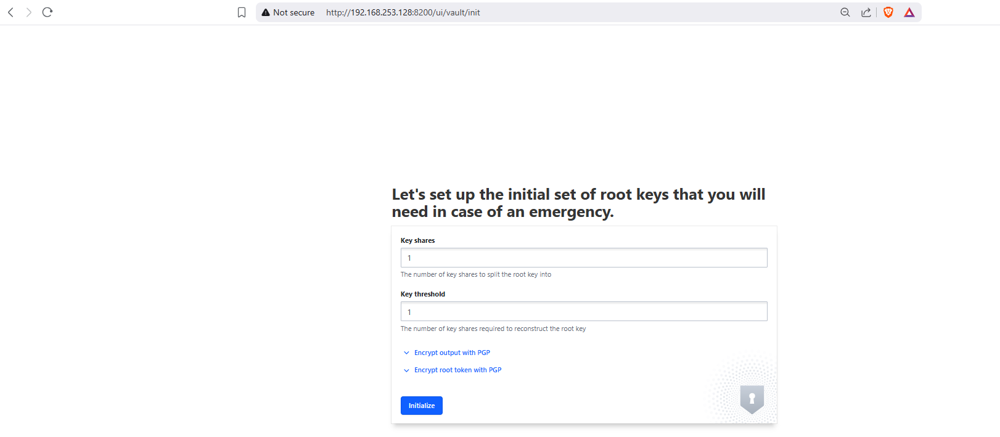

step 2: Download your key

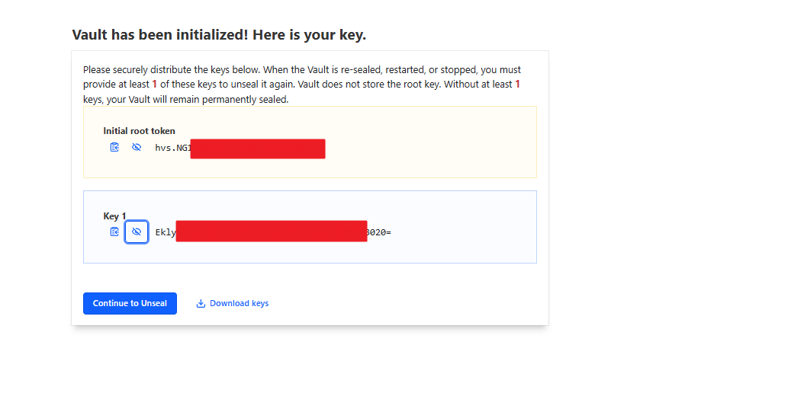

step -3 : unseal your key
use the base64 key from downloaded json
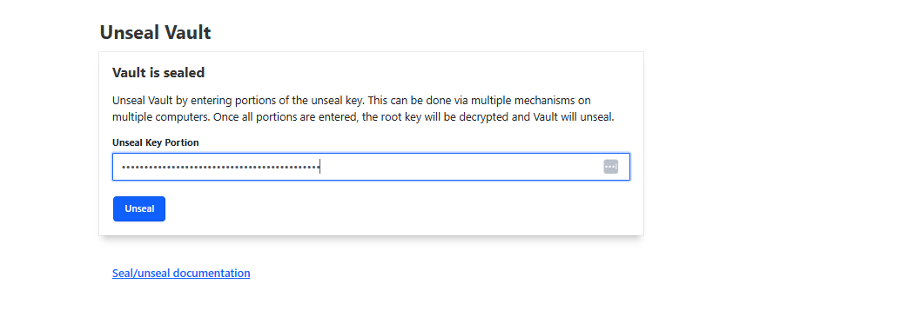

step -4 : login via token
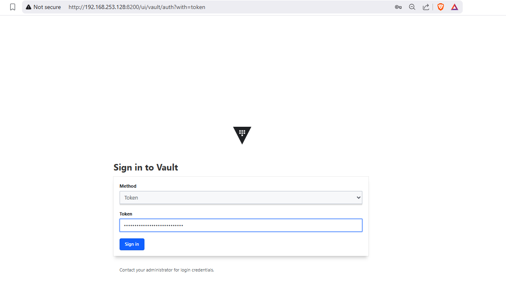

step -5 : Access the dashboard
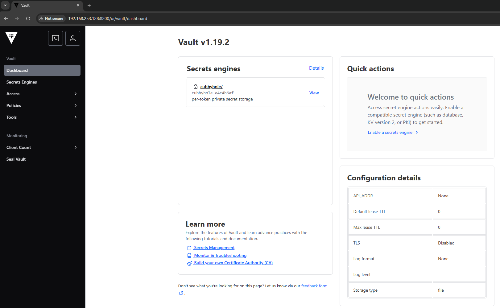

## Customizing the configuration
## initializing secrets for many environemnt
step -1 : here is the list of custom created environment. To add or creat click on **enable new-engine**
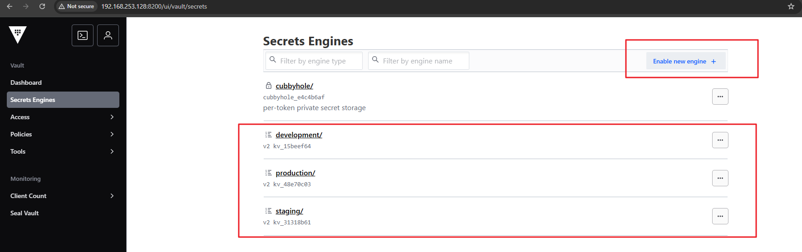 


step -2 : select KV
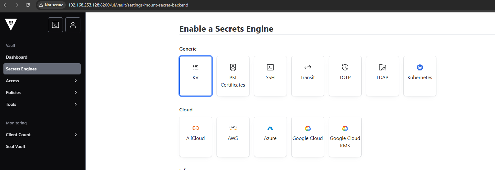 

step -3 : write your environment name
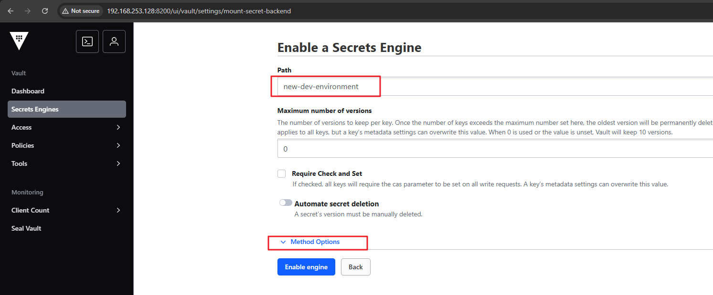

## creating custom policy

[polic-tenplate](policy-template)

there are many policy-template which are given on ```docker-config/policy-template/```

step-1 : creating policy
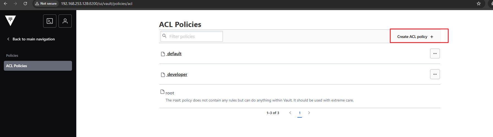

step-2: you can copy paste the policy some tempaltes are given on repoisotry. Edit names **staging,development or production** based on your condition or requirement
 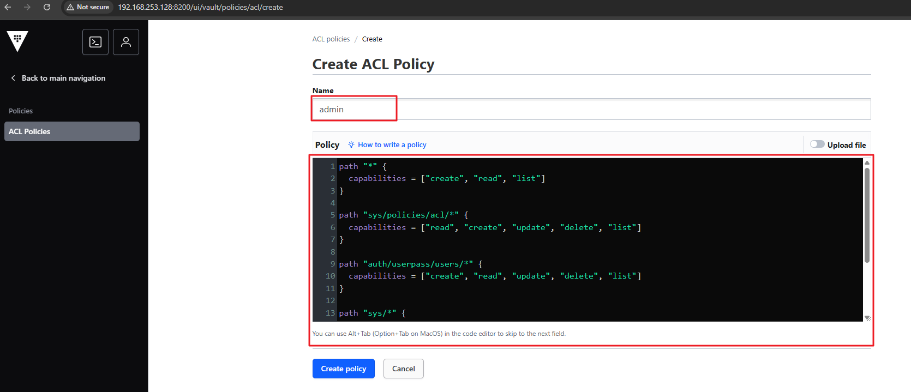 
stpe-2.1 : your can also upload via-file
 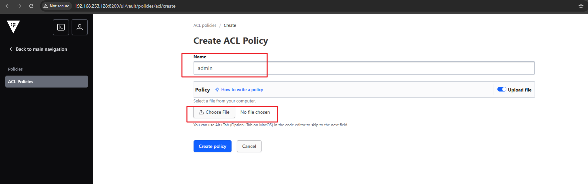 
 
 step-3 : finalizing the changes
 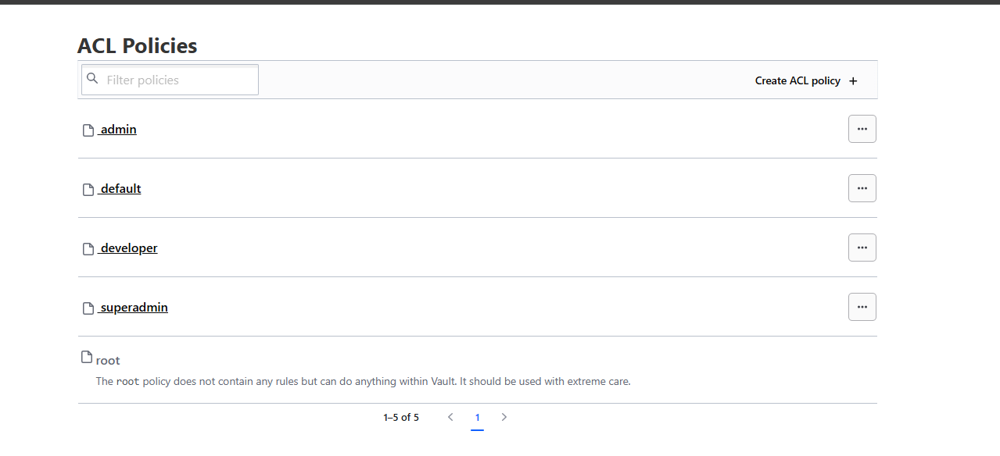

 ### configuring users

step -1 : enable userpass logi9n so that we can login via username and password
 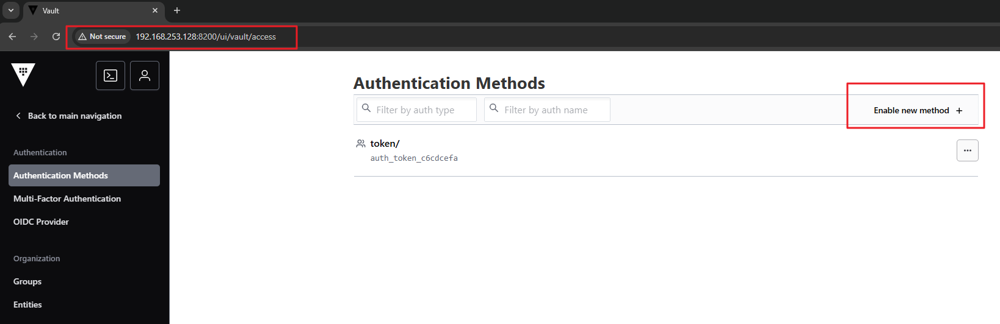
  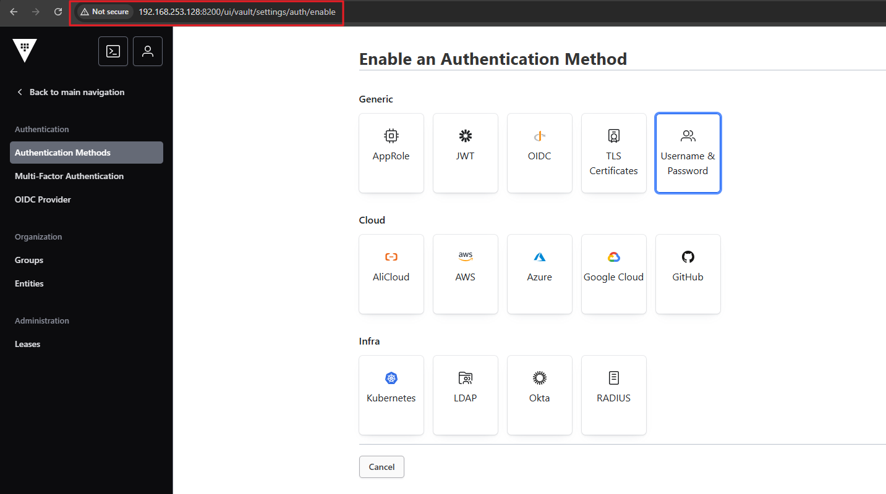 
  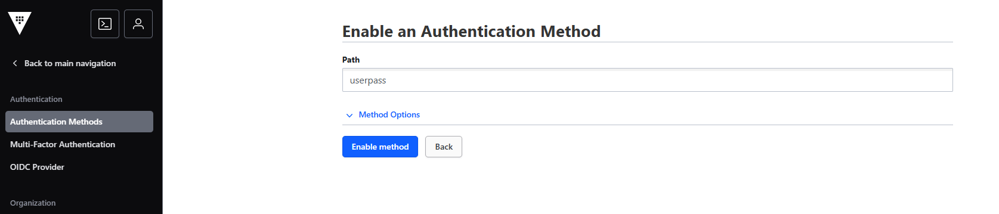 

step -2 :  creating users and attaching policy accordingly
  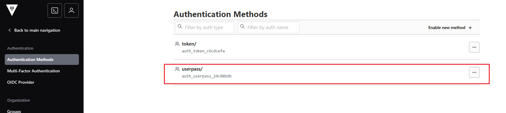
   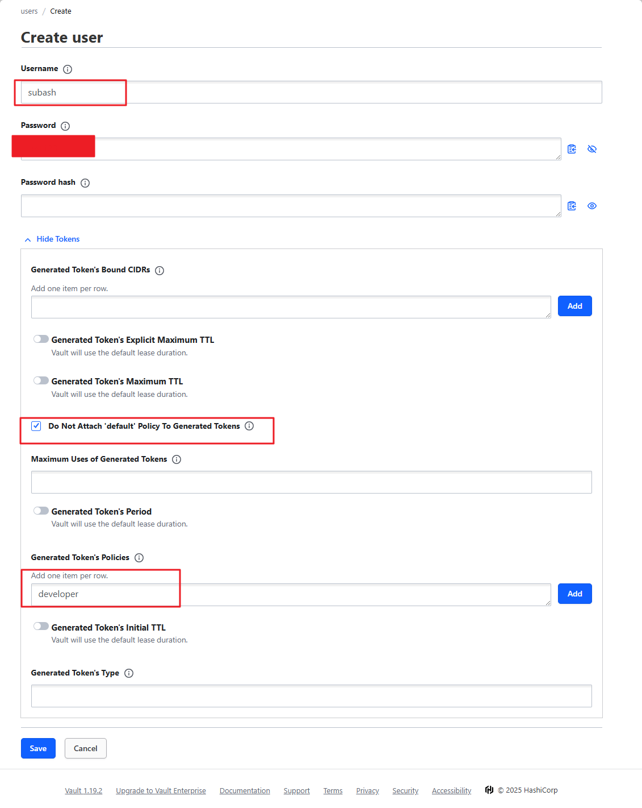 

step-3 : testing users login
   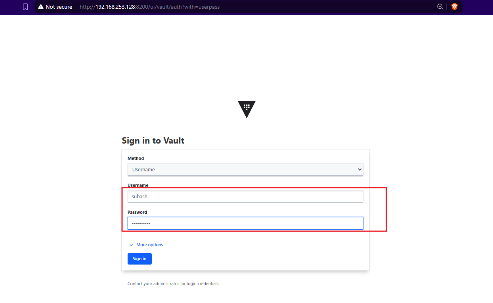 
   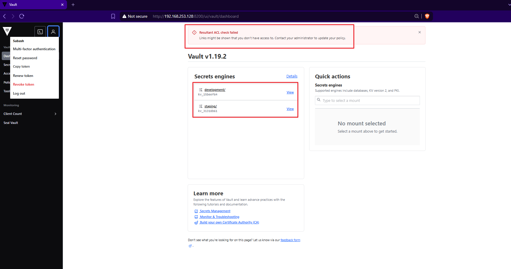